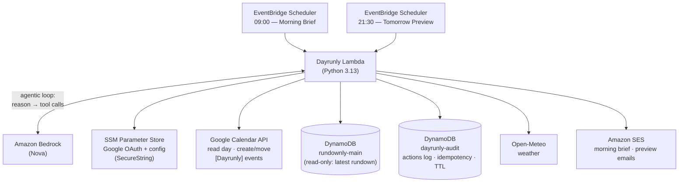

# Dayrunly

**Your day, run for you.** An always-on personal morning agent built for the AWS Builder Center "Build an Always-On Agent" Weekend Challenge — sibling of [Rundownly](https://github.com/GiorgiTarsaidze/rundownly).

Every morning at 09:00 it wakes up on an EventBridge schedule, reads the day's fresh Rundownly news digest, plans reading time into a free calendar slot, protects recurring habits (never books over them, reschedules what collides), and emails a morning brief — all before it's needed. A second run at 21:30 previews tomorrow.

## Architecture

Design doctrine (inherited from Rundownly): **deterministic code does all fetching and mutating; the model only decides.** The LLM never sees credentials, never produces URLs, and every calendar write is idempotent and clearly labeled `[Dayrunly]`.

🚧 Work in progress — full docs and deploy instructions coming with the challenge article.
